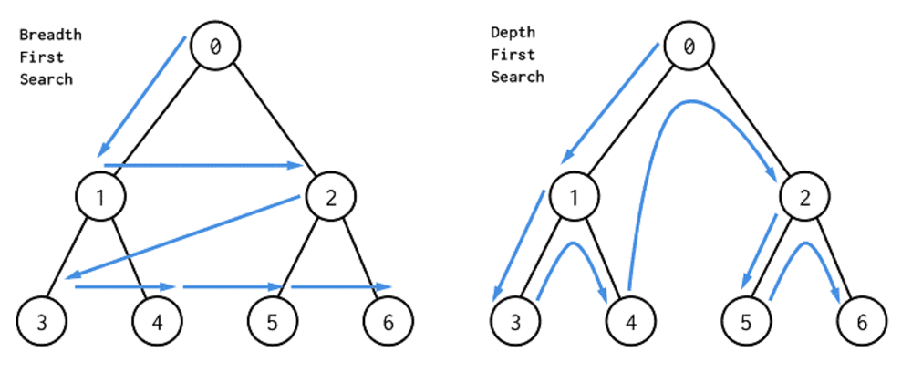
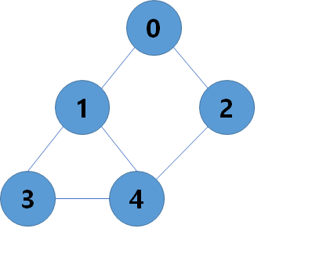

## DFS(Depth First Search) - 깊이 우선 탐색

시작 노드에서 깊이가 커지는 방향으로 탐색을 진행하여  더 이상 방문할 인접 노드가 없는 경우 이전 노드가 돌아가서 다시 깊이 우선 탐색을 반복하게 된다.

*※ 이미지 출처 : [https://dev.to/danimal92/difference-between-depth-first-search-and-breadth-first-search-6om](https://dev.to/danimal92/difference-between-depth-first-search-and-breadth-first-search-6om)*


DFS알고리즘의 탐색은 스택, 재귀호출을 활용할 수 있다.


1. ### 재귀호출

   한 노드에서 인접한 노드를 찾고 그 노드에 대해 또 인접한 노드를 찾을 때 재귀함수를 활용해 구현하는 방식이다. 더 이상 방문할 노드가 없다면 재귀함수를 종료하고 호출했던 함수로 돌아간다.

   ​

   Sample Code (C++)

   ```c++
   #include <iostream>
   #include <cstring>

   using namespace std;

   #define MAXSIZE 10
   int n, e;	// node, edge
   int graph[MAXSIZE][MAXSIZE];
   bool isVisited[MAXSIZE];

   void DFS(int node)
   {		
   	isVisited[node] = true;
   	cout << node << ' ';

   	for (int next = 0; next < n; ++next);
   	{		
   		if (!isVisited[next] && graph[node][next])
   			DFS(next);
   	}
   }

   int main()
   {
   	cin >> n >> e;
   	memset(isVisited, 0, sizeof(isVisited));
   	memset(graph, 0, sizeof(graph));
   	for (int i = 0; i < e; ++i)
   	{
   		int u, v;	// pair of node
   		cin >> u >> v;
   		graph[u][v] = graph[v][u] = 1;
   	}
   	DFS(0);
   	return 0;
   }

   ```

   ​

   

   `<Input>`

   `5 6`

   `0 1 0 2 1 3 1 4 2 4 3 4`

   `<output>`

   `0 1 3 4 2`

   ​

   ​

2. ### 스택

   시작 노드와 연결된 하나의 노드를 Stack에 넣고 이 노드와 연결된 또 다른 하나의 노드를 넣는 과정을 반복한다. 더 이상 간선으로 연결된 정점이 없다면 그 노드를 pop하고 이전 노드로 되돌아간다. 그 후, 인접한 노드가 있는지 확인하는 방식으로 DFS탐색을 한다.

   ​
   Sample Code (C++)

   ```c++
   #include <iostream>
   #include <cstring>
   #include <stack>
    
   using namespace std;
    
   #define MAXSIZE 10
   int n, e;	// node, edge
   int graph[MAXSIZE][MAXSIZE];
    
   void DFS(int node)
   {
   	bool isVisited[MAXSIZE] = { false };
    
   	stack<int> _stack;
   	_stack.push(node);
    
   	while (!_stack.empty())
   	{
   		int cur = _stack.top();
   		_stack.pop();
    
   		if (isVisited[cur]) continue;
   		
   		isVisited[cur] = true;
   		cout << cur << ' ';
    
   		for (int next = 0; next < n; ++next)
   		{
   			if (!isVisited[next] && graph[cur][next])
   				_stack.push(next);
   		}
   	}
   }
    
   int main()
   {
   	cin >> n >> e;
   	memset(graph, 0, sizeof(graph));
    
   	for (int i = 0; i < e; ++i)
   	{
   		int u, v;	// pair of node
   		cin >> u >> v;
   		graph[u][v] = graph[v][u] = 1;
   	}
   	DFS(0);
   	return 0;
   }
   ```

   ​

   

   `<Input>`

   `5 6`

   `0 1 0 2 1 3 1 4 2 4 3 4`

   `<output>`

   `0 2 4 3 1`

   ​

   ​